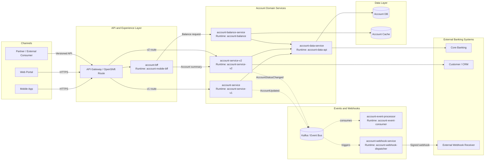
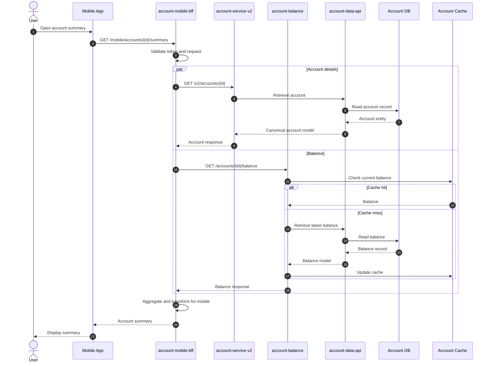
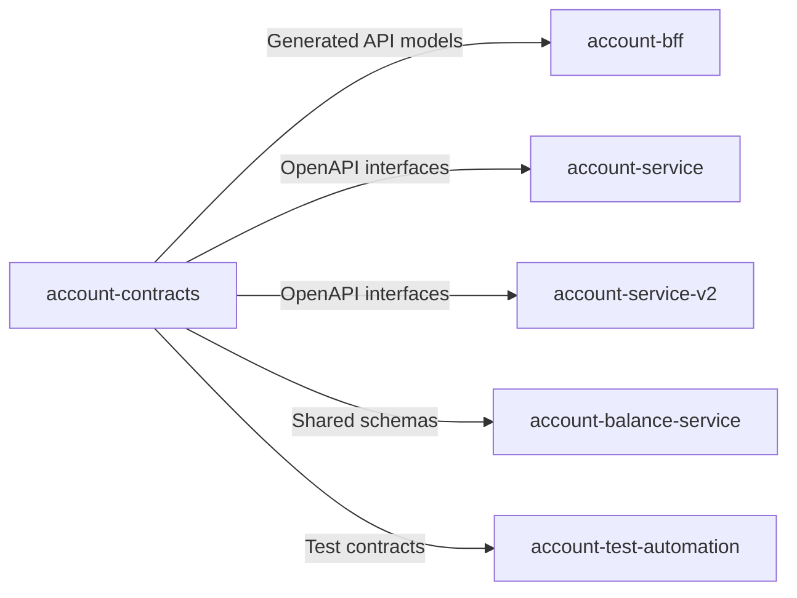
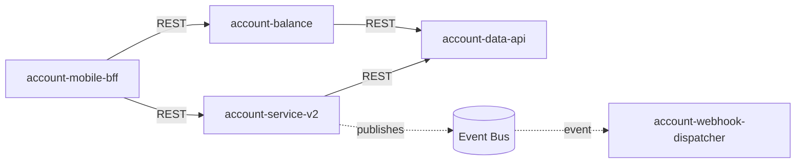
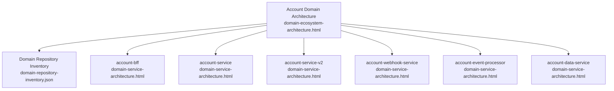

<div align="center">

# 🏦 Domain Architecture Documentation Agents

### Evidence-based architecture documentation for banking domains — generated by GitHub Copilot

**Turn every Java/Spring repository and multi-repo banking domain into navigable, audit-ready HTML architecture documentation.**


[Quick Start](#-quick-start) · [What It Generates](#-what-it-generates) · [Worked Example](#-worked-example--account-domain) · [Sample Prompts](#-sample-copilot-prompts) · [Troubleshooting](#-troubleshooting)

</div>

---

## 💡 What This Package Does

This package provides **reusable GitHub Copilot agent instructions** that document both a **single service repository** and the **complete architecture of a banking domain** spread across multiple repositories — BFFs, versioned services, webhooks, event processors, data services, contracts, and infrastructure.

| 🔍 Repository-Level View | 🌐 Domain-Level View | ✅ Evidence-Based Output |
|---|---|---|
| Documents controllers, services, business rules, repositories, data structures, mappings, integrations, security, deployment, testing, and operational characteristics. | Stitches together BFFs, versioned services, webhooks, event processors, adapters, shared contracts, data services, infrastructure, and runtime dependencies. | Separates confirmed implementation from strongly indicated relationships, assumptions, and gaps — with repository paths and code references for full traceability. |

### Why teams use it

- 🧾 **Audit-ready** — every important statement traces back to files, classes, methods, or configuration keys
- 🧭 **Onboarding-friendly** — new engineers see how each repo is built *and* how deployed components behave at runtime
- 🔀 **Boundary-aware** — repository, build artifact, deployable, runtime service, and domain boundaries are never confused
- 🔐 **Banking-safe** — credentials, tokens, keys, certificates, and customer data are masked by design
- ⚖️ **Honest documentation** — findings are classified as `Confirmed` · `Strongly indicated` · `Assumed` · `Gap`

---

## 📚 Table of Contents

1. [What It Generates](#-what-it-generates)
2. [Quick Start](#-quick-start)
3. [Package Structure](#-package-structure)
4. [Recommended Setup Models](#-recommended-setup-models)
5. [Single-Repository Workflow](#-single-repository-documentation-workflow)
6. [Multi-Repository Domain Workflow](#-multi-repository-domain-documentation-workflow)
7. [Worked Example — Account Domain](#-worked-example--account-domain)
8. [Runtime Interaction Example](#-sample-runtime-interaction--account-summary-retrieval)
9. [Dependency Model](#-sample-dependency-model)
10. [Sample Copilot Prompts](#-sample-copilot-prompts)
11. [Generated Outputs](#-expected-generated-outputs)
12. [Review & Validation Checklist](#-review--validation-checklist)
13. [Troubleshooting](#-troubleshooting)
14. [Design Principles](#-design-principles)
15. [Documentation](#-documentation)

---

## 📦 What It Generates

| Scope | Generated File | Purpose |
|---|---|---|
| 📁 Individual repository | `docs/domain-service-architecture.html` | Detailed implementation, runtime, security, data, deployment, and business-flow documentation for one repository |
| 📁 Individual repository | `docs/domain-service-inventory.json` | Machine-readable component, API, data, event, dependency, and evidence inventory |
| 🌐 Complete domain | `docs/domain-ecosystem-architecture.html` | Multi-repository architecture, capability map, dependency model, cross-repo flows, data ownership, and deployment view |
| 🌐 Complete domain | `docs/domain-repository-inventory.json` | Machine-readable inventory of domain repositories, runtime services, contracts, APIs, events, webhooks, data stores, and dependencies |

> [!TIP]
> **Recommended flow:** Generate the repository-level document first for each application repository, then generate the domain ecosystem document from a multi-root workspace containing all related repositories.

---

## 🚀 Quick Start

> ⏱️ **Up and running in ~10 minutes**

1. **Create or select a GitHub repository**
   Use a private or internal repository for banking and enterprise workloads.

2. **Copy the package files into the repository root**
   Confirm `.github/copilot-instructions.md` and `.github/agents/` sit directly under the repository root.

3. **Open the repository in Visual Studio Code**
   Ensure GitHub Copilot and GitHub Copilot Chat are installed and authenticated.

4. **Single repository?** Run the repository agent
   Ask Copilot Agent mode to use `domain-service-documentation`.

5. **Complete domain?** Open all related repositories in a multi-root workspace
   Include the architecture repo, BFFs, services, webhooks, events, contracts, deployment, and infrastructure repositories.

6. **Run the ecosystem agent**
   Ask Copilot to use `domain-ecosystem-documentation` and name the target domain (e.g. `Account`).

7. **Review before publishing**
   Validate security, secrets masking, diagrams, source references, assumptions, findings, and open questions.

> [!NOTE]
> **Success criterion:** the generated HTML should explain both *how each repository is built* and *how its deployed components participate in end-to-end domain behavior at runtime*.

📖 See [QUICKSTART.md](QUICKSTART.md) for detailed installation and first use.

---

## 🗂 Package Structure

```text
domain-architecture-documentation/
├── .github/
│   ├── copilot-instructions.md                    # Repository-wide Copilot guidance
│   └── agents/
│       ├── domain-service-documentation.agent.md    # Single-repository agent
│       └── domain-ecosystem-documentation.agent.md  # Multi-repository domain agent
├── docs/
│   └── README.md
├── examples/
│   ├── sample-workspace.code-workspace
│   ├── run-single-repository.prompt.md
│   ├── run-domain-ecosystem.prompt.md
│   └── account-domain-example.md
├── scripts/
│   └── validate-package.sh
├── QUICKSTART.md
├── USAGE.md
├── CUSTOMIZATION.md
└── README.md
```

---

## 🏗 Recommended Setup Models

### Model A — Instructions within every application repository

> ✅ Best when each repository team owns and updates its own architecture documentation.

```text
account-service/
├── .github/
│   ├── copilot-instructions.md
│   └── agents/
│       └── domain-service-documentation.agent.md
├── src/
├── pom.xml
└── docs/
```

### Model B — Central domain architecture repository

> ✅ Best for the consolidated multi-repository domain view.

```text
account-domain-architecture/
├── .github/
│   ├── copilot-instructions.md
│   └── agents/
│       ├── domain-service-documentation.agent.md
│       └── domain-ecosystem-documentation.agent.md
├── account-domain.code-workspace
├── prompts/
└── docs/
```

> [!TIP]
> **Use both models together:** local documentation stays close to source code, while the central architecture repository becomes the domain-level entry point and review location.

---

## 🔬 Single-Repository Documentation Workflow

The repository agent inspects:

- **Application code** — Spring Boot entry points, controllers, service classes, domain models, validators, repositories, entities, mappers, schedulers, and exception handlers
- **Contracts & integration** — OpenAPI definitions, API models, event schemas, webhook handlers, client adapters, messaging configuration, and database migrations
- **Build & platform** — Maven/Gradle files, Dockerfiles, Helm charts, Kubernetes/OpenShift resources, Terraform/CloudFormation, CI/CD workflows, tests, and observability configuration

### Typical output sections

| 🏛 Architecture | 🧠 Business Logic | 🗄 Data | ⚙️ Operations |
|---|---|---|---|
| System context, internal components, deployment topology, external systems, trust boundaries | Critical rules, validation, decision logic, transaction boundaries, failures, source-code traceability | Entities, schemas, data dictionary, transformations, mappings, encryption, persistence, ownership | Health, logging, metrics, tracing, resilience, CI/CD, runtime configuration, support gaps |

---

## 🌐 Multi-Repository Domain Documentation Workflow

The ecosystem agent **discovers** repositories in the workspace, determines which belong to the domain, **classifies** them, maps them to runtime services, and **separates build-time dependencies from runtime interactions**.

### Recommended workspace

```text
account-domain-workspace/
├── account-domain-architecture/   # Central architecture repo (Model B)
├── account-service/               # Core domain service (v1)
├── account-service-v2/            # Versioned domain service
├── account-bff/                   # Backend-for-frontend
├── account-webhook-service/       # Outbound notifications
├── account-event-processor/       # Event consumer
├── account-data-service/          # Controlled data access
├── account-contracts/             # OpenAPI / AsyncAPI / schemas
├── account-infrastructure/        # OpenShift, AWS, networking
└── account-test-automation/       # Contract & E2E tests
```

### Boundaries the ecosystem agent must distinguish

| Boundary | Meaning | Example |
|---|---|---|
| 📁 Repository | Source-control and ownership boundary | `account-bff` |
| 📦 Build artifact | Produced JAR, library, schema package, or container image | `account-bff-2.4.0.jar` |
| 🚢 Deployable | Kubernetes/OpenShift deployment or AWS workload | `account-mobile-bff` |
| 🔌 Runtime service | Process or network endpoint active at runtime | `account-query-v2` |
| 🏦 Domain | Business capability and ownership boundary | Account servicing |

---

## 🏦 Worked Example — Account Domain

> [!WARNING]
> **Evidence status:** this is a sample architecture only. In a generated document, every component and relationship must be classified as `Confirmed` · `Strongly indicated` · `Assumed` · `Gap`.

### Illustrative repositories

| Repository | Category | Primary Responsibility | Typical Runtime Component |
|---|---|---|---|
| `account-bff` | BFF | Channel-specific orchestration and response aggregation | `account-mobile-bff` |
| `account-service` | Core domain service | Account retrieval, status, servicing, business rules | `account-service-v1` |
| `account-service-v2` | Versioned domain service | Newer API contract and revised domain behavior | `account-service-v2` |
| `account-balance-service` | Capability service | Current and available balance retrieval | `account-balance` |
| `account-webhook-service` | Webhook service | Outbound status-change notifications and delivery tracking | `account-webhook-dispatcher` |
| `account-event-processor` | Event consumer | Consumes account events, updates projections/downstream systems | `account-event-consumer` |
| `account-data-service` | Data service | Controlled data access for account records and reference data | `account-data-api` |
| `account-contracts` | Contract repository | OpenAPI, AsyncAPI, JSON/Avro schemas, generated clients, shared DTOs | *No runtime service* |
| `account-infrastructure` | Infrastructure repository | OpenShift, AWS, networking, messaging, secrets refs, observability | *No application runtime* |

### Sample overarching architecture



### How to interpret the architecture

- 📱 The **BFF** is optimized for a channel and can aggregate responses from multiple domain services
- 🔀 **Versioned services** (v1/v2) coexist while clients migrate between contracts
- 🗄 The **data service** centralizes database access when direct database ownership is intentionally separated
- ⚡ **Events** support asynchronous propagation without forcing consumers into a synchronous call chain
- 📤 The **webhook service** converts internal domain events into externally delivered callbacks
- 📜 The **contracts repository** affects build-time compatibility but does not necessarily create a runtime dependency
- 🏗 The **infrastructure repository** defines runtime deployment and platform resources but may not produce an application service

---

## 🔄 Sample Runtime Interaction — Account Summary Retrieval

How a single channel request crosses the BFF, versioned Account service, balance service, data layer, and cache:



### What the generated documentation captures for this flow

| Area | Required Detail |
|---|---|
| 🚪 Entry point | Route, HTTP method, authentication, authorization, headers, validation, request model |
| 🎛 BFF orchestration | Parallel vs. sequential calls, timeout behavior, aggregation rules, transformations, partial-failure handling |
| 🧠 Domain services | Business rules, source classes and methods, data dependencies, transaction boundaries, errors |
| 🗄 Data access | Entity mapping, queries, schema, encryption, masking, caching, system-of-record ownership |
| 📤 Response | Field mapping, data filtering, defaulting, sensitive-data handling, response codes |

---

## 🧩 Sample Dependency Model

Build-time and runtime dependencies are **always documented separately** — a core design rule of this package.

### Build-time dependencies



### Runtime dependencies



### Relationship types used in the dependency matrix

| Marker | Relationship | Example |
|:---:|---|---|
| **B** | Build-time dependency | Generated client or shared library |
| **R** | Runtime synchronous dependency | REST or gRPC call |
| **E** | Event or messaging dependency | Kafka topic or SQS queue |
| **W** | Webhook dependency | Signed outbound callback |
| **D** | Data dependency | Shared schema or direct database access |
| **C** | Contract dependency | OpenAPI, AsyncAPI, Avro, or JSON Schema |
| **I** | Infrastructure dependency | Helm chart, Terraform module, or route configuration |
| **T** | Test dependency | Contract tests or shared test fixtures |

---

## 📋 Per-Repository Documentation Details

Each repository gets an individual architecture page; the domain ecosystem page summarizes and links them.

<details>
<summary><strong>📱 Account BFF repository</strong></summary>

- Consuming channels and user journeys
- APIs exposed to mobile, web, branch, or partner channels
- Domain APIs called, orchestration sequence, aggregation, and transformation
- Token propagation, authorization, caching, timeouts, retries, and partial-response behavior
- Business logic that belongs in the BFF vs. logic delegated to domain services

</details>

<details>
<summary><strong>🏦 Core and versioned Account service repositories</strong></summary>

- Business capabilities owned by each version
- API paths, supported consumers, contract differences, migration behavior, deprecation evidence
- Duplicate or inconsistent business logic across versions
- Shared vs. independent persistence and event models
- Version adapters, translation layers, and compatibility risks

</details>

<details>
<summary><strong>📤 Webhook repository</strong></summary>

- Inbound and outbound webhook flows
- Registration, callback URL management, signature validation, retry, delivery guarantees, duplicate handling
- Payload transformation from internal events to external webhook contracts
- Dead-letter handling, audit logging, and failure escalation

</details>

<details>
<summary><strong>⚡ Event processor repository</strong></summary>

- Topics, queues, event names, versions, producers, and consumers
- Partitioning, ordering, correlation, idempotency, replay, retry, and dead-letter behavior
- Projection updates, downstream integrations, and eventual-consistency impacts

</details>

<details>
<summary><strong>🗄 Data service and persistence repositories</strong></summary>

- System-of-record ownership, schemas, entities, tables, relationships, migrations
- Cross-service database access, shared databases, duplicate persistence, replication, caches
- Data classifications, encryption, masking, retention, audit fields, transaction boundaries

</details>

---

## 💬 Sample Copilot Prompts

### ▶️ Generate documentation for one Account repository

```text
Use the domain-service-documentation agent.

Analyze this repository as part of the Account banking domain.

Generate:
- docs/domain-service-architecture.html
- docs/domain-service-inventory.json

Document the service purpose, APIs, controllers, components, business logic,
repositories, entities, database structures, data elements, transformations,
translations, encryption, events, webhooks, external integrations, AWS and
OpenShift deployment, CI/CD, security, observability, and end-to-end runtime flows.

Trace important statements to repository-relative files, classes, methods, and
configuration keys. Mark findings as Confirmed, Strongly indicated, Assumed, or Gap.
Do not expose credentials, tokens, keys, certificates, or customer-sensitive data.

Validate HTML navigation, diagram syntax, repository references, and masking
before completing.
```

### ▶️ Generate the complete Account domain ecosystem document

```text
Use the domain-ecosystem-documentation agent.

Analyze all repositories in this workspace that belong to the Account domain.

Generate:
- docs/domain-ecosystem-architecture.html
- docs/domain-repository-inventory.json

Discover and classify core services, versioned services, BFFs, webhook services,
event processors, data services, shared libraries, contract repositories,
infrastructure repositories, deployment repositories, test repositories, and adapters.

Map repository boundaries to build artifacts, container images, deployments,
runtime services, APIs, events, webhooks, data stores, contracts, and external systems.

Document build-time and runtime dependencies separately. Include repository landscape,
capability map, runtime dependency graph, build dependency graph, repository-to-runtime
mapping, version relationships, BFF orchestration, webhook lifecycle, event flows,
data ownership, cross-repository transformations, security boundaries, AWS/OpenShift
deployment, CI/CD release dependencies, failure impact, coupling risks, findings,
recommendations, and open questions.

Trace critical Account journeys such as account summary retrieval, balance retrieval,
account status update, account closure, statement access, AccountStatusChanged event,
and outbound webhook notification.

Link to each repository's docs/domain-service-architecture.html where available.
Use only evidence-supported relationships and classify every relationship as Confirmed,
Strongly indicated, Assumed, or Gap. Validate coverage, Mermaid syntax, links, evidence
references, and sensitive-data masking before completing.
```

📁 More ready-to-run prompts live in [`examples/`](examples/).

---

## 📤 Expected Generated Outputs

### Within each service repository

```text
<repository>/
└── docs/
    ├── domain-service-architecture.html
    └── domain-service-inventory.json
```

### Within the central architecture repository

```text
account-domain-architecture/
└── docs/
    ├── domain-ecosystem-architecture.html
    └── domain-repository-inventory.json
```

### Recommended documentation hierarchy



---

## ✅ Review & Validation Checklist

Run [`scripts/validate-package.sh`](scripts/validate-package.sh) and confirm the following before publishing:

### 🏛 Architecture
- [ ] All repositories are included, excluded, or marked unclassified
- [ ] Repository and runtime-service boundaries are not confused
- [ ] Build-time and runtime dependencies are separated
- [ ] Versioned APIs and migration paths are documented

### 🔐 Security & Data
- [ ] No credentials, secrets, tokens, keys, or customer data appear
- [ ] Trust boundaries and encryption controls are documented
- [ ] Data ownership, shared databases, masking, and retention gaps are visible

### 🔎 Quality & Traceability
- [ ] Important findings have file, class, method, or configuration references
- [ ] Assumptions and gaps are clearly labelled
- [ ] Mermaid diagrams render and match the written inventory
- [ ] HTML navigation and repository links work

> [!CAUTION]
> Do **not** publish generated architecture documentation until security, application, data, platform, and domain owners have reviewed it for accuracy and information classification.

---

## 🔧 Troubleshooting

| Problem | Likely Cause | Action |
|---|---|---|
| Agent cannot see sibling repositories | Repositories were not added to the same VS Code multi-root workspace | Add every required folder via **File → Add Folder to Workspace**, save the workspace, and rerun the agent |
| Copilot ignores the custom agent | Agent file is not under `.github/agents/` or the workspace was not reopened | Correct the path, reload VS Code, and explicitly ask Copilot to use the named agent |
| Generated diagrams are too large | Too many repositories and relationships in one graph | Request a summary diagram plus detailed diagrams grouped by layer, capability, or dependency type |
| Relationships inferred from repository names only | Insufficient code or configuration evidence found | Require file-level evidence and downgrade unsupported relationships to **Assumed** or **Gap** |
| Mermaid does not render offline in the HTML guide | Mermaid loads from a public CDN | Download an approved Mermaid build internally and replace the script reference with a local file |
| Generated output exposes sensitive values | Configuration or sample data copied without masking | Remove the values immediately, rotate exposed secrets if necessary, and strengthen masking instructions before regeneration |

---

## 🧭 Design Principles

| Principle | What It Means |
|---|---|
| 🧾 **Evidence-based** | Every claim is traceable to code or configuration |
| 🔀 **Separation of concerns** | Build-time and runtime dependencies documented separately |
| 🧱 **Boundary clarity** | Repository, artifact, deployment, and runtime boundaries distinguished |
| 🔐 **Data protection** | Banking data and secret values masked by design |
| 📊 **Honest state** | Current state separated from recommendations |
| 👥 **Multi-audience** | HTML outputs suitable for architecture review, onboarding, audit support, and operational understanding |

---

## 📖 Documentation

| Document | Description |
|---|---|
| [QUICKSTART.md](QUICKSTART.md) | Installation and first use in ~10 minutes |
| [USAGE.md](USAGE.md) | Detailed usage patterns for both agents |
| [CUSTOMIZATION.md](CUSTOMIZATION.md) | Adapting agents to your domains and standards |
| [examples/](examples/) | Sample workspace, ready-to-run prompts, and a worked Account domain example |

---

## 🤝 Contributing & Adaptation

This package ships with **illustrative names and relationships** — adapt repository names, domain capabilities, deployment terminology, and governance requirements to your organization. Improvements to agent instructions, prompts, and validation scripts are welcome via pull request.

<div align="center">

**Built for engineering and architecture teams who believe documentation should be generated from evidence — not written from memory.**

⭐ If this package saves your team time, consider starring the repository.

</div>
